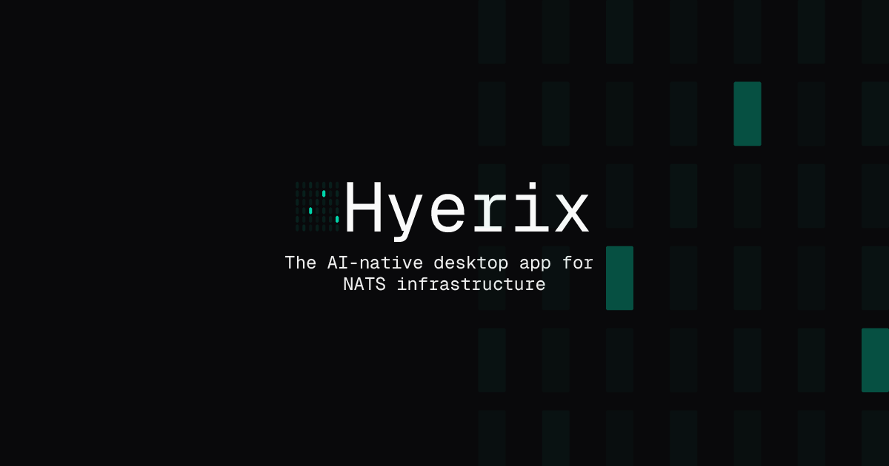

  

<h1 align="center">Hyerix</h1>

  <strong>Hyerix is an AI-native desktop GUI for NATS infrastructure.</strong>

  <a href="https://hyerix.ai">hyerix.ai</a> &nbsp;·&nbsp;
  <a href="https://docs.hyerix.ai">Docs</a> &nbsp;·&nbsp;
  <a href="https://hyerix.ai#download">Download (macOS · Windows · Linux)</a> &nbsp;·&nbsp;
  <a href="https://hyerix.ai/pricing">Pricing</a>

---

Operating NATS in production means stitching together `nats` CLI flags, `jq` pipelines, Prometheus dashboards, and a folder of config files — then hoping nothing drifts between environments. Hyerix replaces that workflow with a single desktop application: one view of your streams, consumers, KV buckets, object stores, services, and cluster topology, paired with **Signal AI**, an AI layer that turns live telemetry into plain-English answers.

Everything runs locally. Credentials, message payloads, and cluster state stay on your machine.

## What's inside

| | |
|---|---|
| **Streams & JetStream** | Create, edit, inspect, and tail streams, consumers, KV buckets, and object stores through a unified interface. |
| **Signal AI** | Ask "which consumers are lagging?" or "why is this stream backing up?" and get answers drawn from live cluster state, not generic docs. |
| **Config validation** | Catch retention mismatches, under-replicated streams, and resource limit conflicts before you hit apply. |
| **Real-time monitoring** | Time-series metrics, anomaly detection, and root-cause analysis for slow consumers and cluster health. |

## Built for NATS operators

Hyerix runs as a native desktop app with a local-first AI layer that speaks to Ollama on-device or your own OpenAI key. Available for macOS, Windows, and Linux. No cluster data leaves your machine.

## Find us

- **Website** — [hyerix.ai](https://hyerix.ai)
- **Documentation** — [docs.hyerix.ai](https://docs.hyerix.ai)
- **Download** — [hyerix.ai#download](https://hyerix.ai#download)
- **Pricing** — [hyerix.ai/pricing](https://hyerix.ai/pricing)
- **X / Twitter** — [@hyerixAI](https://x.com/hyerixAI)

  Hyerix <code>/ˈhaɪ.rɪks/</code> — rhymes with "high tricks".

